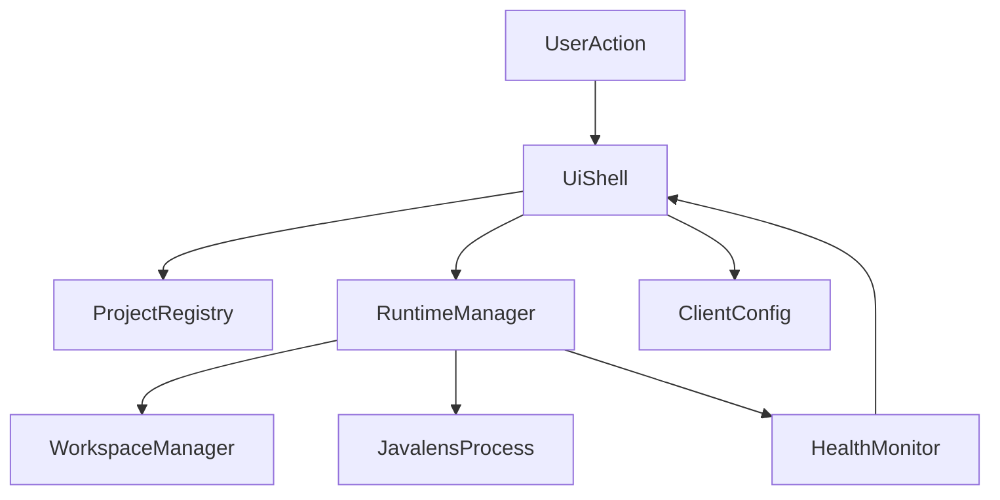

# Architecture

## Architectural Intent

`javalens-manager` is a desktop management layer around upstream `javalens-mcp`.

It should:

- orchestrate and supervise runtimes
- manage project-level configuration
- provide a good desktop UX
- stay clearly separated from Java semantic analysis itself

It should not:

- embed custom Java analysis logic
- fork upstream `javalens-mcp`
- collapse UI, config, process management, and client setup into one module

## Core Constraints

- upstream `javalens-mcp` stays unchanged
- runtime management must work per project
- project source trees should stay clean
- configuration and process state must be understandable and debuggable
- the architecture should support multiple managed projects without changing the core model

## Proposed Module Boundaries

- `ui-shell`: desktop screens, state display, user actions
- `project-registry`: known projects, metadata, and local settings
- `runtime-manager`: start, stop, restart, and supervise `javalens` processes
- `workspace-manager`: map projects to managed workspaces and runtime directories
- `health-monitor`: status checks, liveness, and error reporting
- `client-config`: generated MCP configuration for external clients where useful

## Runtime Model

The manager should assume one isolated `javalens` runtime per managed project.

That keeps the model simple:

- one project entry
- one runtime definition
- one workspace/data location
- one status and health stream

Multi-project behavior is achieved by repeating this model cleanly, not by turning a single `javalens` instance into a multi-project server.

## High-Level Flow

## Design Principles

- Prefer small, explicit modules over a single app controller.
- Keep process supervision logic independent from UI code.
- Make configuration serializable and testable.
- Treat generated client configuration as an adapter, not as core domain state.
- Start with the simplest reliable lifecycle before adding convenience features.

## Testing Strategy

Use selective TDD where it gives the highest value:

- unit tests for config parsing and validation
- unit tests for registry and path mapping
- lifecycle tests for start, stop, restart, and error states
- integration tests for process wiring and health behavior
- manual checks for early UI polish until the runtime model stabilizes

## ADR Candidates

These should become Architecture Decision Records early:

- why `javalens-manager` is a separate repo
- why upstream `javalens-mcp` remains untouched
- workspace and runtime directory strategy
- how generated MCP client config is handled
- frontend choice inside the Tauri shell
